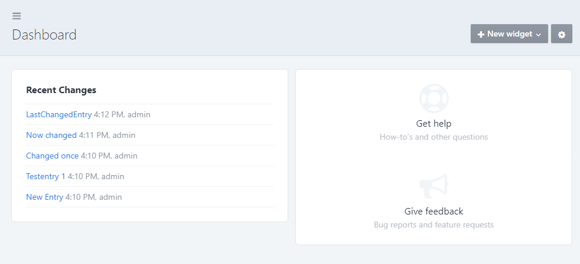

# recentchanges plugin for Craft CMS 4.x

A Widget showing the last updated entries. (Forked from the original RecentEntries Widget included in [Craft 4](https://github.com/craftcms/cms))

 
The username is only shown in `Craft Pro` because you only have one user in `Craft Solo`.

## Requirements

This plugin requires Craft CMS 4.0.0 or later.

## Installation

To install the plugin, follow these instructions.

1. Open your terminal and go to your Craft project:

        cd /path/to/project

2. Then tell Composer to load the plugin:

        composer require vardump/recentchanges

3. In the Control Panel, go to Settings → Plugins and click the “Install” button for recentchanges.

## Configuring recentchanges

Go to the Dashboard and add a Recent Changes Widget. 

You can choose a section and the number of entries shown. 

Brought to you by [vardump.de](https://vardump.de)